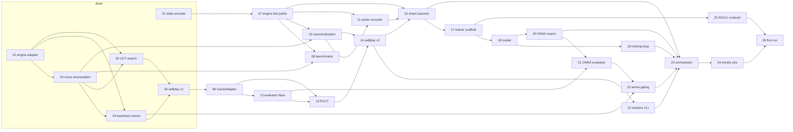

# Offline AlphaZero Trainer — Master Plan

An offline job that iterates **self-play → training → gating** on a single
machine, producing a policy+value network strong enough for real-time play
against humans. Ora et Labora (2-player, long, France) is the baseline game;
the core is game-agnostic so similar games can plug in later.

This index links one design doc per project. Each project doc states how it
runs, what it consumes, and what it produces. Projects already implemented in
the repo are included as specs (phrased forward-looking) so the plan is
self-contained; their **Status** column below reflects reality.

> Supersedes [`docs/mcts-self-play-plan.md`](../mcts-self-play-plan.md), whose
> Phases 1–3 correspond to projects 01–06 here.

## Locked decisions

| Decision | Choice |
| --- | --- |
| Model | **Full AlphaZero**: policy + value heads from the start, PUCT with priors |
| Policy scheme | **Move-scoring over enumerated candidates** (not flat action space, not token-factorized) — see [11](11-action-encoder.md) |
| Stack | Node self-play (TS engine) · PyTorch training · ONNX for Node inference |
| Hardware | One machine: RX 7800 XT 16 GB on bare-metal Ubuntu + ROCm (`gfx1101`, HSA override). Plain PyTorch so a ≤$50 CUDA rental or CPU works identically — see [25](25-rocm-runbook.md) |
| Core interface | Game-agnostic `GameAdapter` — see [09](09-game-adapter.md) |
| First config | 2-player · long · France |
| Durable data | JSONL of games (commands + per-decision candidates/visits); tensors regenerated per training run |

## The generation loop

```
        ┌──────────────────────────────────────────────────────────┐
        ▼                                                          │
  selfplay (Node workers, PUCT + net_k)  ──►  gen-N/*.jsonl        │
  export  (Node, replay + encode)        ──►  gen-N/shards/*.npy   │
  train   (Python, GPU)                  ──►  ckpt + model.onnx    │
  arena   (Node, net_new vs best)        ──►  promote? ────────────┘
```

Gen-0 uses pure-UCT rollouts (no net) to bootstrap. `mcts:400` stays in the
arena forever as the fixed-strength yardstick; the "it works" moment is
NN-guided PUCT beating pure UCT at equal simulations.

## Projects

| # | Project | Package | Depends on | Milestone | Status |
| --- | --- | --- | --- | --- | --- |
| [01](01-state-encoder.md) | State encoder (egocentric tensor) | `game/` | — | — | ✅ done |
| [02](02-engine-adapter.md) | Engine adapter | `agent/` | — | — | ✅ done |
| [03](03-move-enumeration.md) | Move enumeration & sampling | `agent/` | 02 | — | ✅ done |
| [04](04-baselines-arena.md) | Baseline policies & arena | `agent/` | 02, 03 | — | ✅ done |
| [05](05-uct-search.md) | Pure UCT search | `agent/` | 02, 03 | — | ✅ done |
| [06](06-selfplay-v1.md) | Self-play generator v1 | `agent/` | 04, 05 | — | ✅ done |
| [07](07-engine-fast-paths.md) | Engine fast paths | `game/` | 01 | M1 | planned |
| [08](08-benchmarks.md) | Benchmark harness | `agent/` | 03, 07 | M1 | planned |
| [09](09-game-adapter.md) | GameAdapter interface | `agent/` | 02–06 | M2 | planned |
| [10](10-move-canonicalization.md) | Move canonicalization | `agent/` | 03, 07 | M2 | planned |
| [11](11-action-encoder.md) | ActionSpec & move encoder | `agent/` | 07, 10 | M3 | planned |
| [12](12-evaluator-interface.md) | Evaluator interface | `agent/` | 09 | M4 | planned |
| [13](13-puct-search.md) | PUCT search | `agent/` | 09, 12 | M4 | planned |
| [14](14-selfplay-v2.md) | Self-play v2 (JSONL v2) | `agent/` | 10, 13 | M4 | planned |
| [15](15-selfplay-workers.md) | Worker-pool self-play CLI | `agent/` | 14 | M4 | planned |
| [16](16-shard-exporter.md) | Tensor shard exporter | `agent/` | 07, 11, 14 | M5 | planned |
| [17](17-trainer-scaffold.md) | Trainer scaffold (Python/uv) | `trainer/` | 16 | M5 | planned |
| [18](18-model.md) | Network architecture | `trainer/` | 17 | M5 | planned |
| [19](19-training-loop.md) | Training loop | `trainer/` | 18 | M5 | planned |
| [20](20-onnx-export.md) | ONNX export & parity | `trainer/` | 18 | M5 | planned |
| [21](21-onnx-evaluator.md) | ONNX evaluator in Node | `agent/` | 12, 20 | M6 | planned |
| [22](22-arena-gating.md) | Arena gating & promotion | `agent/` | 04, 21 | M6 | planned |
| [23](23-orchestrator.md) | Generation orchestrator | `agent/` | 15, 16, 19, 20, 22 | M6 | planned |
| [24](24-smoke-e2e.md) | Smoke end-to-end run | repo | 23 | M6 | planned |
| [25](25-rocm-runbook.md) | ROCm hardware bring-up | `trainer/` | 17 | M7 | planned |
| [26](26-first-run.md) | First real training run | ops | 24, 25 | M7 | planned |

## Dependency graph



## Milestones (each ships as one or a few PRs)

| Milestone | Projects | Exit criterion |
| --- | --- | --- |
| M1 — Engine fast paths | 07, 08 | `completions()` ≡ `control().completion` parity; benchmark numbers pinned |
| M2 — Game-agnostic core | 09, 10 | Existing agent tests green through the adapter; canonical dedupe proven |
| M3 — Action encoding | 11 | Every enumerated move over fixture states encodes NaN-free |
| M4 — Search v2 | 12–15 | PUCT-with-uniform-priors ≈ UCT strength at equal sims; JSONL v2 round-trips |
| M5 — Training pipeline | 16–20 | Overfit test on 10 games; Node↔Python shard round-trip bit-exact; torch↔ONNX parity |
| M6 — Closed loop | 21–24 | `pnpm loop --config tiny.json --gens 2` finishes end-to-end in minutes |
| M7 — Real run | 25, 26 | A promoted generation beats pure UCT at equal sims |

## Run directory layout (shared vocabulary)

```
runs/<run-id>/
  config.json            # game cfg + search + selfplay + train + gate params
  best.json              # current champion { gen, onnx, ckpt, arena }
  gen-NNN/
    STATE                # selfplay | exported | trained | gated  (resume marker)
    selfplay/worker-*.jsonl
    shards/shard-*/      # .npy tensors (regenerable; pruned after gating)
    ckpt/model.pt
    model.onnx  spec.json
    arena.json  train-log.jsonl
```

## Primary risk

Self-play throughput (~1–3 s/move at 200 sims ⇒ ~500 games/day on 12
workers). Levers, in order: `completions()` fast path (07), curation caps,
sims scheduling, in-worker batching (12), completion caching. Measure before
building more infrastructure — that is what 08 exists for.

## Later (out of scope here)

- Real-time deployment behind the web/MCP `make_move` seam (see
  [`docs/mcp-server-design.md`](../mcp-server-design.md)).
- Second game onboarding: implement `GameAdapter` + `ActionSpec` for the new
  game; search/selfplay/exporter/trainer are reused unchanged.
- 3–4 player configs: value head is already a per-player vector; no
  architecture change.
